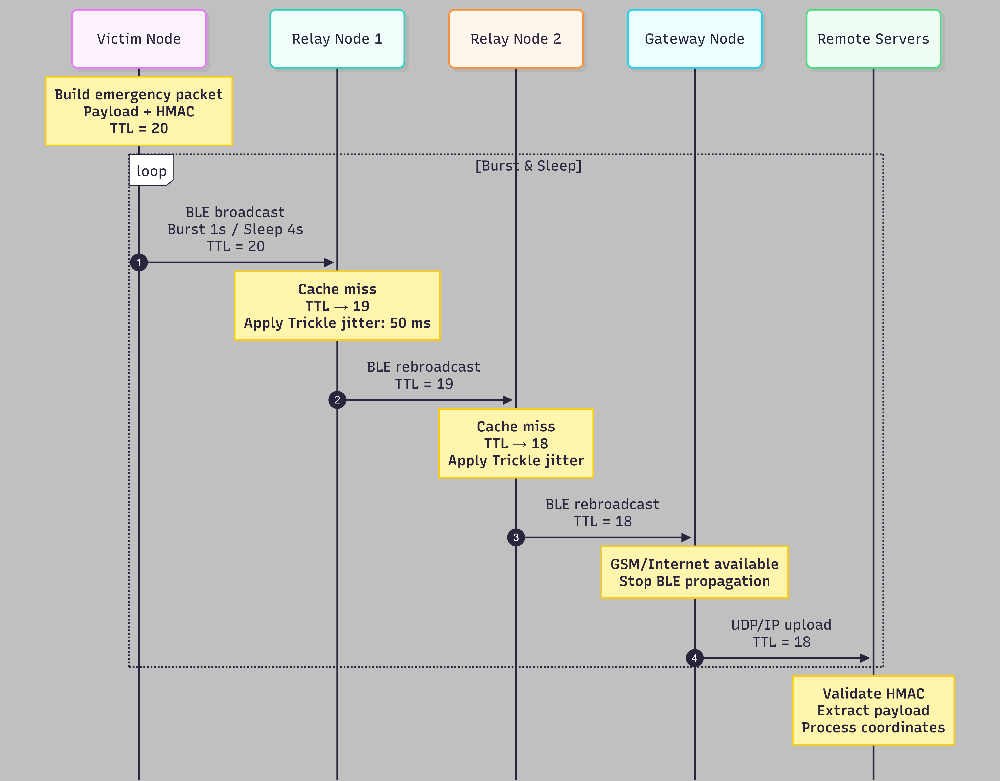

# BLE Beacon Mesh

A decentralized Bluetooth Low Energy mesh for emergency payload relay over short-range broadcast links. The design is built around BLE 4.0 Advertising only, so any compatible device can participate as a transmitter or relay without setting up a connection.

## Core Model

The system uses managed flooding.

A source node builds a fixed-size emergency packet, publishes it as Manufacturer Specific Data, and repeats the broadcast in short bursts. Relay nodes scan continuously, inspect each advertisement, discard duplicates through a local cache, decrement TTL, and rebroadcast only after a randomized delay. A gateway node is just another relay that can forward the payload to an upstream service when external connectivity exists.

The goal is to avoid attempting to keep track of the network's state. There is no routing table, no connection graph, and no explicit neighbor discovery protocol. Forwarding decisions are local and time bounded.

## Packet Format

The on-air payload is packed into a 25-byte `emergencyPacket` structure. In BLE advertising, it is carried inside Manufacturer Specific Data with a 2-byte Company ID prefix, so the full manufacturer blob is 27 bytes and still fits inside the 31-byte legacy advertising data budget.

```cpp
struct __attribute__((packed)) emergencyPacket
{
    uint32_t phone;
    uint32_t timestamp;
    uint8_t flags;

    union LocationData
    {
        struct __attribute__((packed))
        {
            int32_t latitude;
            int32_t longitude;
        } gps;

        uint64_t nonce;
    } payload;

    uint8_t hmac_sig[8];
};
```

### Field Breakdown

- `phone` is a 32-bit MurmurHash3 hash of the sender identifier with a fixed seed and peppered input
- `timestamp` is a minute-resolution timestamp used for preventing anti-replay attacks
- `flags` stores one location availability bit and a 5-bit TTL field
- `payload` is either GPS coordinates or an opaque nonce used to keep repeated emissions distinct when required
- `hmac_sig` is an 8-byte truncated HMAC over the packet body

## Routing Logic

Forwarding is controlled by a local cache rather than by topology knowledge.

Each relay keeps a fixed-size time-aware cache indexed by the packet HMAC. A new frame is accepted only once per cache lifetime. If the packet is new, the relay decrements TTL, stores the frame, and schedules a rebroadcast after a random delay between 50 ms and 200 ms. The delay is the suppression window that reduces synchronized retransmissions.

Broadcast storm control comes from three checks:

- duplicate suppression through the HMAC cache
- TTL exhaustion at each hop
- redundancy suppression using observed sender MACs and a small receive counter threshold

If a relay hears the same packet too many times before its own timer expires, it marks the frame as covered and cancels rebroadcast. The implementation also uses a bounded 500 ms transmit burst on the advertising side, then returns to scanning.

### Data Flow

The diagram below illustrates the managed flooding loop, from the initial broadcast to gateway interception.

<p align="center">
  
</p>

## BLE Constraints

The implementation relies on legacy BLE Advertising because it is the lowest common denominator for older phones and embedded nodes. This choice avoids connection setup and pairing overhead.

Only Manufacturer Specific Data is used for the application payload. The layout is intentionally compact so it stays inside the legacy advertising data limit without depending on newer extended advertising features.

## Repository Layout

- `arduino/` ESP32 implementation for the source and relay roles
- `udp-simulator/` C++ mesh simulator that mirrors the relay logic over UDP
- `python-scanner/` simple BLE scan utility for inspecting live advertisements

## Building

### ESP32 with PlatformIO

This project uses [PlatformIO](https://platformio.org/) for dependency management and reproducible builds. The configuration is handled in `arduino/platformio.ini`.

1. **Clone the repository and navigate to the hardware directory:**
    ```bash
    git clone https://github.com/The-TallGuy/ble-beacon-mesh
    cd ble-beacon-mesh/arduino
    ```

2. **Build and flash the firmware to a connected ESP32 via USB:**
    ```bash
    pio run -e relay -t upload
    ```

3.  **Monitor serial output:**
    ```bash
    pio device monitor
    ```

### Troubleshooting

**Windows Compilation Errors (Path Too Long):**
If building on Windows fails with missing file errors deep in the framework directory, you may need to enable long path support in the registry:
1. Open PowerShell as Administrator.
2. Run: `New-ItemProperty -Path "HKLM:\SYSTEM\CurrentControlSet\Control\FileSystem" -Name "LongPathsEnabled" -Value 1 -PropertyType DWORD -Force`
3. Restart your terminal or IDE.

## Gateway Node Configration

If you intend to use a device as a gateway node, forwarding BLE packets over Wi-Fi via UDP, you must configure your network credentials:

1. Locate `secrets.example.h` in the `arduino/include` directory.
2. Copy or rename it to `secrets.h`.
3. Update `WIFI_SSID`, `WIFI_PASS`, and the upstream `SERVER_IP` with your local test environment details.

*Note: `secrets.h` is ignored by Git to prevent accidentally leaking network credentials.*

## References

The routing and caching logic in this implementation was heavily informed by the following literature:

* **[The Trickle Algorithm (RFC 6206)](https://datatracker.ietf.org/doc/html/rfc6206)**: Levis, P., et al. (IETF, 2011). *Used for the adaptive timing and suppression mechanisms.*
* **[The Broadcast Storm Problem in a Mobile Ad Hoc Network](https://www.researchgate.net/publication/220293186_The_Broadcast_Storm_Problem_in_a_Mobile_Ad_Hoc_Network)**: Ni, S., et al. (ACM MobiCom '99). *Referenced for understanding redundancy, contention, and collision in wireless flooding.*